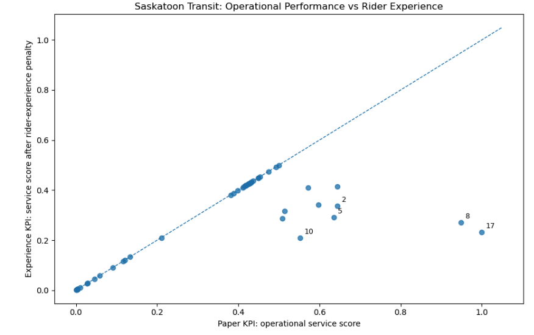
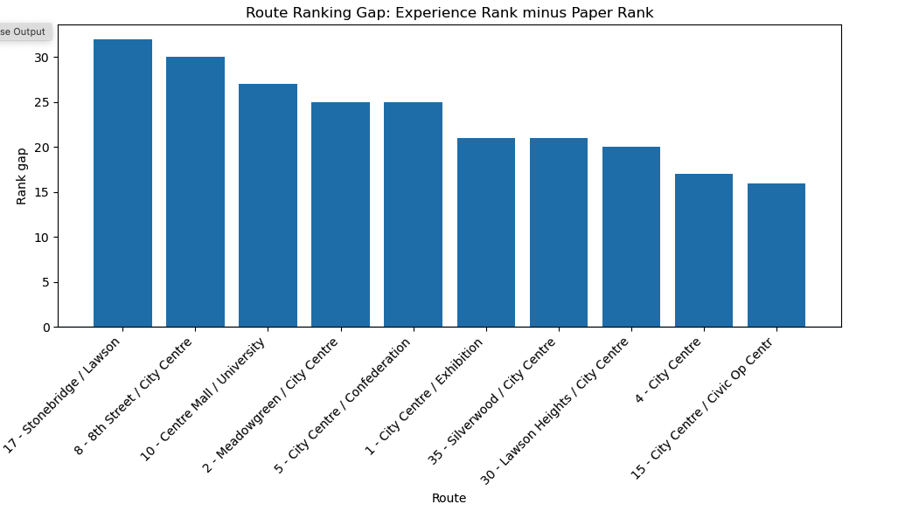

# 🚌 Saskatoon Transit: Experience vs Operational Performance 

# 🔎 Problem 
Transit agencies typically evaluate performance using operational metrics such as service frequency and reliability. However, these metrics may not fully capture the *** lived rider experience ***.

This project explores:
> **Do routes that perform well operationally also deliver a good rider experience?**

---

## 🎯 Objective

- Identify routes where **operational performance and rider experience diverge**
- Develop an **experience-weighted KPI**
- Highlight **high-priority routes for improvement**

---

## 📊 Data Sources

- GTFS data from Saskatoon Transit  
  - Routes, trips, stop times, calendar  
- Simulated rider experience signals (crowding, sentiment)  
  - Used to approximate real-world rider feedback  

---

## 🧠 Approach

1. **Operational KPI (Paper KPI)**
   - Based on total trips per route (service volume)

2. **Experience KPI**
   - Combines:
     - Service level
     - Crowding proxy
     - Rider sentiment proxy

3. **Ranking Comparison**
   - Routes ranked by:
     - Operational performance
     - Experience-adjusted performance

4. **Gap Analysis**
   - Identify routes where:
     - High service ≠ good experience

---

## 📈 Key Insights

- Routes with the highest service levels do not always provide the best rider experience  
- High-frequency routes often accumulate the most dissatisfaction signals  
- Rider dissatisfaction is driven by **compounding issues** (e.g., delays + crowding)  
- There is a measurable gap between **what is tracked** and **what riders feel**

---

## 🖼️ Example Visualizations

---

## 🚧 Example Insight

> “Route 17 ranks highest operationally but drops significantly when accounting for rider experience, indicating that increasing service alone may not resolve dissatisfaction.”

---

## 🚀 Recommendations

- Introduce **experience-weighted KPIs** alongside operational metrics  
- Prioritize routes with **high service but poor experience**  
- Track **co-occurring issues** (e.g., crowding + delays)  
- Integrate real-time rider feedback into performance monitoring  

---

## ⚠️ Limitations

- Rider experience data is simulated due to lack of route-level complaint data  
- Findings are **directional**, not statistically representative  
- GTFS data does not capture real-time delays or perception  

---

## 🧠 Key Takeaways
### Operational efficiency does not guarantee rider satisfaction.
Integrating rider experience into performance measurement can lead to better transit planning decisions.

---

## 🧪 How to Run

- </> bash
- pip install -r requirements.txt

### Open the notebook:
- </> bash
- jupyter notebook notebook/saskatoon_transit_experience_kpi.ipynb

